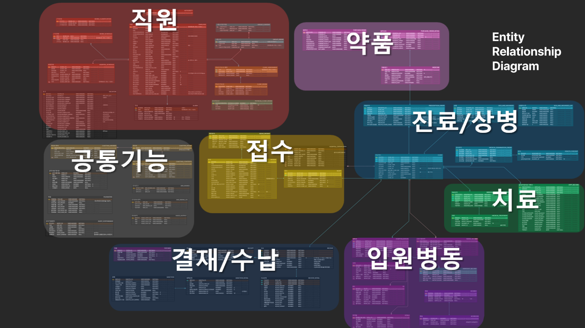

### 대덕인재개발원 최종 프로젝트 ✨메디폼 재활병원 EMR✨
 
메디폼 재활병원 의무기록관리시스템을 소개합니다!   
저의 EMR은 기존 제약이 많고 복잡한 EMR과는 달리 병원 업무에 적합한 메뉴 및 기능 구현 엑셀 파일 데이터를 수작업으로 작성하지 않고,  
실시간으로 집계 및 보고가 가능해 업무 효율을 더욱 향상 시키며 간편한 차트 입력을 통해 진료 효율을 극대화 할 수 있습니다.
  
이번 프로젝트에서는 사용자의 만족감, 효율성 증가, 간편함, 접근성, 고객 회전률을 실시간으로 빠르게 처리함을 기대합니다.  

팀원은 총 7명이며, 프로젝트에서 저는 DA역할을 맡았고,  
테이블 정의서 및 논리/물리 ERD 용어와 테이블의 연관관계를 설계하였습니다.
  

 
-메디폼 재활병원 ERD-
  
위와 같이 50여개 테이블로 설계하였고, 프로세스 흐름은 환자의 접수를 통해 진료 후 처방, 치료, 투약을 할 수 있고,  
입원이 필요한 경우 입원을 할 수 있으며, 그에 관련 기록을 작성하는 테이블이 존재합니다.  
모든 처리가 끝난 후 수납과 영수증을 출력할 수 있는 테이블로 구성하였습니다.  
마지막으로 공통기능에서는 메디폼 재활병원의 게시판, 알람, 채팅 테이블을 설계하였습니다.
  
개발 진행일정 입니다.
#### 2023.09.20 프로젝트 팀 구성  
#### 2023.10.06 설계 및 산출물 작성
#### 2023.11.15 UI구현 및 개발 로직 구현 
#### 2023.11.16 프로젝트 발표
 

##### 이번 프로젝트에서 간호사 시스템과 공통기능인 환자관리를 맡았으며,
##### API 기술로는 Echarts, 풀켈린더, 소켓을 이용한 알람 기능 진행하였습니다.

 

#### 📬 Contacts
  

  #
### 💪Project Skills  
   #### [ Languages ]   
  
 

  

  #### [ Tools ]  
    
 

<!--
**ji-yeon-ing/ji-yeon-ing** is a ✨ _special_ ✨ repository because its `README.md` (this file) appears on your GitHub profile.

로고 쓸때

이미지 사진 조절이 필요업는 경우

// 편의에 따라 바꾸는 코드 -- text문구, 색상코드, height, fontSize 등
// header

// footer

이미지 사이즈 조절해서 올리는 경우

Here are some ideas to get you started:

- 🔭 I’m currently working on ...
- 🌱 I’m currently learning ...
- 👯 I’m looking to collaborate on ...
- 🤔 I’m looking for help with ...
- 💬 Ask me about ...
- 📫 How to reach me: ...
- 😄 Pronouns: ...
- ⚡ Fun fact: ...
-->
